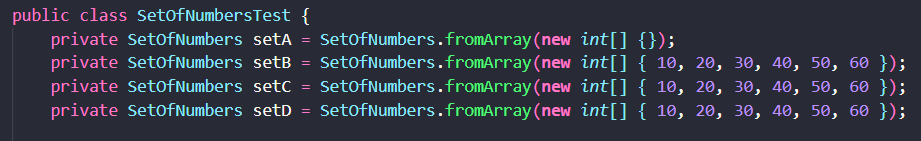
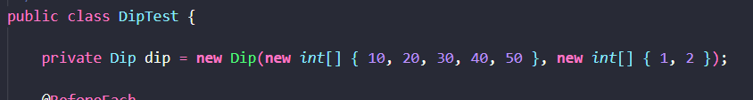
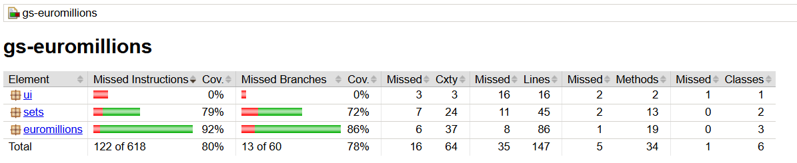
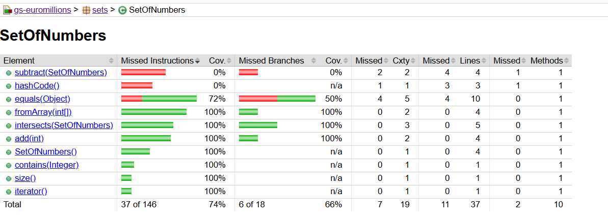
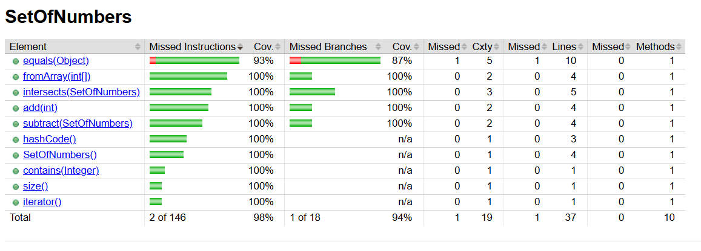
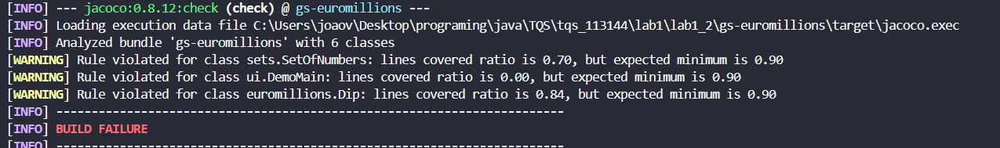
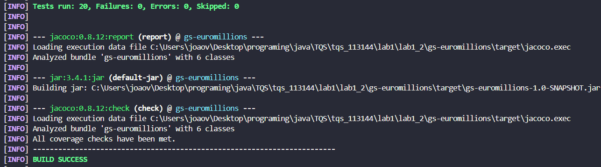

Tive um problema ao executar comandos do Maven, pois os testes estavam a falhar durante o build. O erro ocorria porque, ao correr os testes no build, as anotações **@BeforeEach** e **@AfterEach** não eram executadas corretamente, resultando em falhas.  

No entanto, este problema só acontecia com alguns comandos do **mvn**—quando os testes eram executados diretamente pelo **testing do VS Code**, funcionavam normalmente.  

Para resolver a questão, defini valores padrão para as variáveis dos testes. Como esses valores não interferem na lógica dos testes (porque são substituídos pelos métodos anotados com **@BeforeEach** e **@AfterEach**), o erro no build deixou de ocorrer.  

Abaixo estão alguns exemplos dos valores pré-definidos que utilizei.

**Fig. 1** - Adição de valores aos sets 

**Fig. 2** - Adição de uma dip. 

### **c)**  
A class com menor coverage é a **DemoMain.java**, enquanto os métodos com menor coverage são **subtract** da classe **SetOfNumbers** e os métodos **hashCode**.  
Nem todos os ramos possíveis estão cobertos.  

Evidências disponíveis em: **jacocoSites\site_c)\jacoco\index.html**  

  
**Fig. 3** - Relatório do coverage geral  

  
**Fig. 4** - Relatório do coverage da classe **SetOfNumbers**  

---

### **d)**  
Há mais testes unitários que podem ser escritos para validar corretamente o **BoundedSetOfNaturals**, tais como:  
- **testSubtract()**  
- **testHashCode()**  
- **testEquals()**  

---

### **e)**  
Comparação da classe **SetOfNumbers** antes e depois das alterações:  

  
**Fig. 5** - Estado antes das alterações  

  
**Fig. 6** - Estado após as alterações  

---

### **f) e g)**  
O comando **mvn clean test jacoco:check** não funciona, mas **mvn clean verify** realiza a verificação corretamente.  

Antes da adição dos novos testes, o build falhava porque nem todas as classes atingiam os **90%** de coverage exigidos:  

  
**Fig. 7** - Falha no **check** devido ao coverage insuficiente  

Após a adição dos novos testes, todas as classes atingiram **mais de 90% de coverage**, e o build foi aprovado:  

  
**Fig. 8** - **Check** bem-sucedido após novos testes