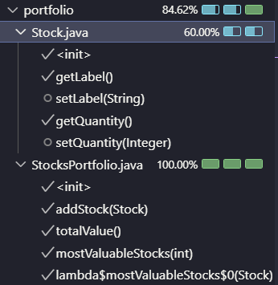

b)
Ao usar isto:
    @Mock
    IStockmarketService market;
    @InjectMocks
    StocksPortfolio portfolio;
depois tem de usar isto:
@ExtendWith(MockitoExtension.class) antes da class de test.
Se usar isto:        
IStockmarketService market = Mockito.mock(IStockmarketService.class);
StocksPortfolio portfolio = new StocksPortfolio(market);
na função de teste já não é presiso aquilo.

d)
Ao adicionar um when amains que não é usado / não tem um stock correstpondent á este erro:
org.mockito.exceptions.misusing.PotentialStubbingProblem: 
Strict stubbing argument mismatch. Please check:
 - this invocation of 'lookUpPrice' method:
    market.lookUpPrice("OPENEI");
 at stocks.portfolio.StocksPortfolio.totalValue(StocksPortfolio.java:20)
 - has following stubbing(s) with different arguments:
    1. market.lookUpPrice("MARVEL");
 at stocks.portfolio.StocksPortfolioTest.testTotalValue(StocksPortfolioTest.java:29)
Typically, stubbing argument mismatch indicates user mistake when writing tests.
Mockito fails early so that you can debug potential problem easily.
However, there are legit scenarios when this exception generates false negative signal:
  - stubbing the same method multiple times using 'given().will()' or 'when().then()' API
    Please use 'will().given()' or 'doReturn().when()' API for stubbing.
  - stubbed method is intentionally invoked with different arguments by code under test
    Please use default or 'silent' JUnit Rule (equivalent of Strictness.LENIENT).
For more information see javadoc for PotentialStubbingProblem class.
 at stocks.portfolio.StocksPortfolio.totalValue(StocksPortfolio.java:20)
 at stocks.portfolio.StocksPortfolioTest.testTotalValue(StocksPortfolioTest.java:35)
 at java.base/java.util.ArrayList.forEach(ArrayList.java:1596)
 at java.base/java.util.ArrayList.forEach(ArrayList.java:1596)

e)
Sim está corresta a implentacao da IA e cobre apropriadamente.
